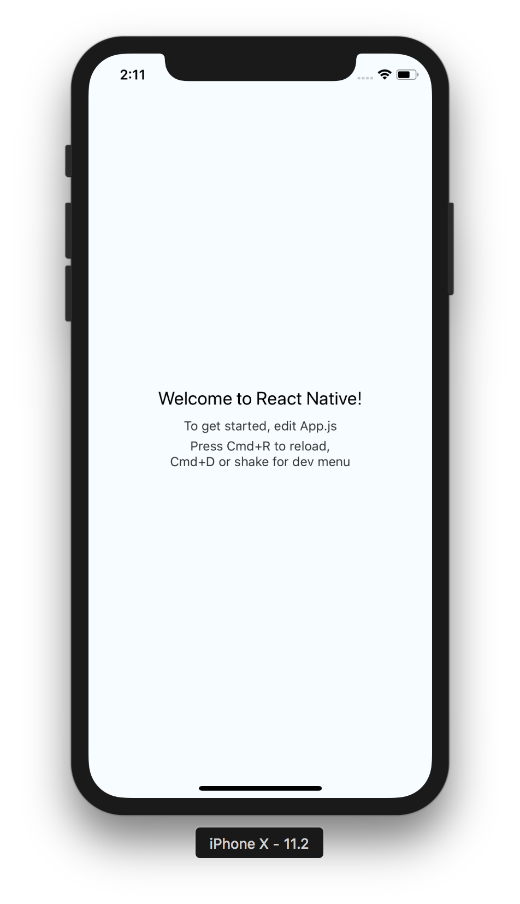
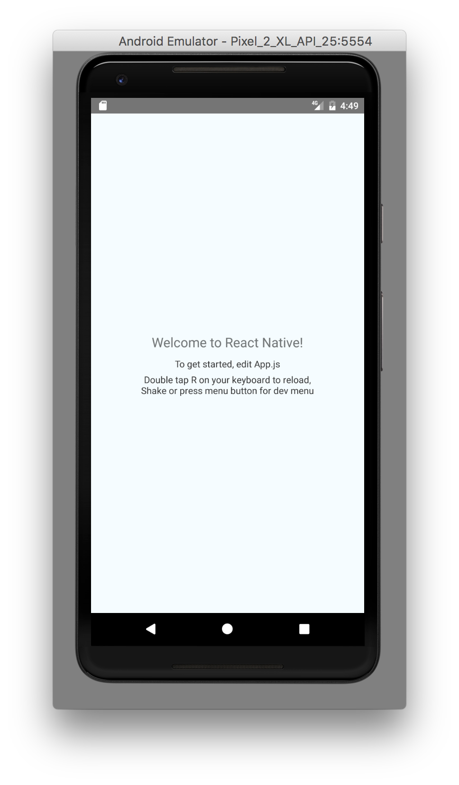

# 3. Setting up our first React Native application

If you've followed the [installation](../1_installation) steps correctly, we would have react-native-cli installed globally on our systems.

In your terminal, run:

```
react-native init ReactNativeWorkshop
```

This will initialise our first application, using yarn if you have it installed or npm otherwise.
 
Now we'll run the application and learn the developer tools.

## Running the application on iOS

1. Open `/ios/ReactNativeWorkshop.xcodeproj` in XCode
1. Run the application
1. CMD + D on simulator or shake on device to open developer menu
1. Enable hot reloading




## Running the application on Android

1. Open `/android` in Android Studio
1. Run the application
1. CMD + M on simulator or shake on device to open developer menu
1. Enable hot reloading



## Breaking down the default application

1. Open the root folder on your favourite JavaScript IDE
1.
```jsx harmony
// index.js
import { AppRegistry } from 'react-native';
import App from './App';

// Entry point to the project
// Registering the default application 'ReactNativeWorkshop' required by the native projects
AppRegistry.registerComponent('ReactNativeWorkshop', () => App);
```
1.
```jsx harmony
// App.js
import React, { Component } from 'react';

// react-native native components
// API can be found on react-native documentation https://facebook.github.io/react-native/docs/view.html
import {
  Platform,
  StyleSheet,
  Text,
  View
} from 'react-native';

// Platform specific code
// Platform.select({}), along with Platform.OS === 'ios|android' allows you to conditionally show content based off the platform
const instructions = Platform.select({
  ios: 'Press Cmd+R to reload,\n' +
    'Cmd+D or shake for dev menu',
  android: 'Double tap R on your keyboard to reload,\n' +
    'Shake or press menu button for dev menu',
});

// Exporting a component which is imported by index.js
export default class App extends Component<{}> {
  render() {
    return (
      <View style={styles.container}>
        <Text style={styles.welcome}>
          Welcome to React Native!
        </Text>
        <Text style={styles.instructions}>
          To get started, edit App.js
        </Text>
        <Text style={styles.instructions}>
          {instructions}
        </Text>
      </View>
    );
  }
}

// Stylesheets used within native components
// Flexbox is the default layout style, similar syntax to modern web CSS
const styles = StyleSheet.create({
  container: {
    flex: 1,
    justifyContent: 'center',
    alignItems: 'center',
    backgroundColor: '#F5FCFF',
  },
  welcome: {
    fontSize: 20,
    textAlign: 'center',
    margin: 10,
  },
  instructions: {
    textAlign: 'center',
    color: '#333333',
    marginBottom: 5,
  },
});
```

[Continue >>](../4_extending_our_app)
