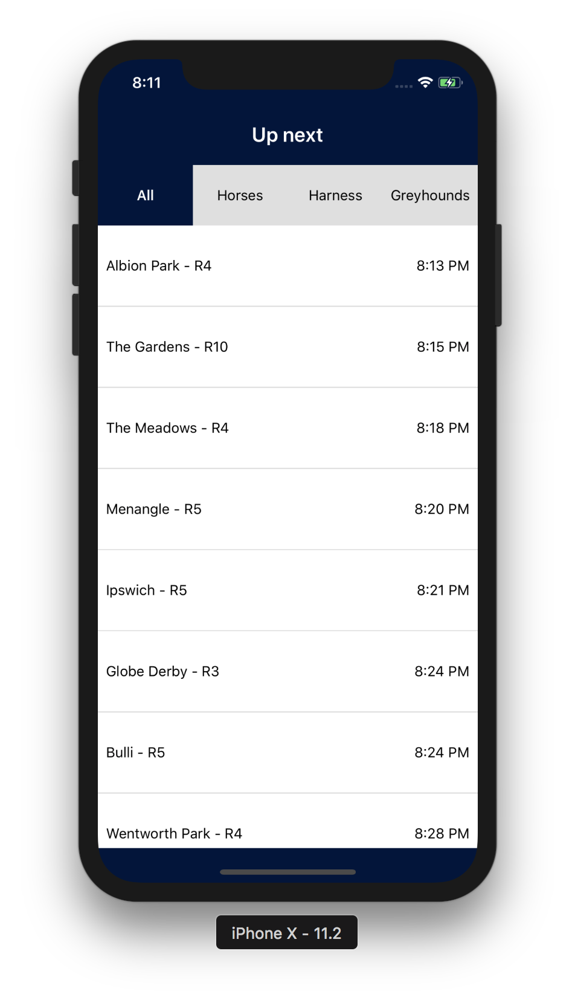

# 5. Up next list

To start with, let's design our layout of our up next list.

There are 3 requirements:
 
## Header

Designers have advised that they would like a header:
- 60pt height, '#00143c' backgroundColor
- A title "Up next" in the positioned vertically and horizontally centered, 20pt fontSize, '700' fontWeight

(Advanced) We'd also like the <StatusBar /> barStyle to be "light-content" so we can see it better.
    
## Filter on race types

They would also like to filter content based off race types. Each one of these filters should be clickable, and have a height of 60pt, backgroundColor of '#dfdfdf' and when selected, backgroundColor of '#00143c' and '700' fontWeight.
- All (0)
- Horses (1)
- Harness (2)
- Greyhounds (3)
    
(Advanced) Scroll left and right between the race types.

## FlatList of events based off filters

We'll need to fetch data from https://www.williamhill.com.au/experience/racing/upcomingracing

When we are loading the data, display an <ActivityIndicator />.

They would like to see a <FlatList /> of racing events based off the selected filter.
- Venue name
- Race number
- Time of jump format(h:mm A) right aligned

Each of these items will need to be clickable, along with having a height of 80pt, horizontal padding of 8pt, border bottom 1pt '#ddd'.

(Advanced) Show the time of race as a countdown until jump.
