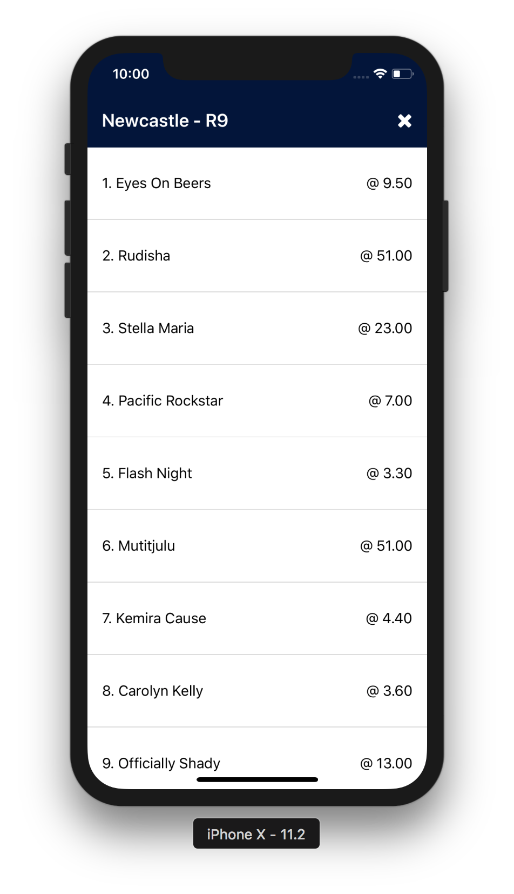
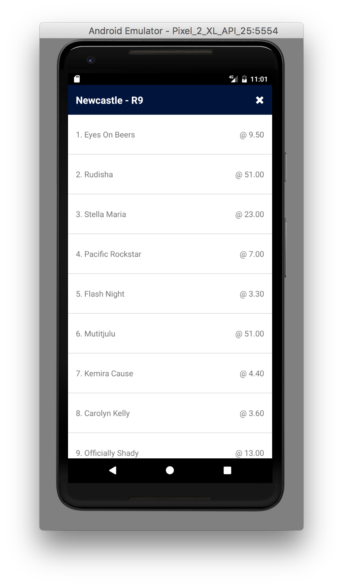

# 6. Event and runners list

Now we'll move onto our event and runners list. Notice how in the previous requirements, we needed each event to be clickable?

We would like to display a list of runners for each event upon clicking the button.

Unconventionally however, we'll be opening a modal to display the runners rather than using push navigation. This is intentional to showcase native features.





## Before we begin

We've previously installed several JavaScript packages, however this time we'll be installing a native package which requires updates to native iOS and Android.

Thankfully, React Native now comes with rnpm command line built in, allowing linking of native packages with a simple CLI.

There are several handy open source community packages such as:

- [react-native-vector-icons](https://github.com/oblador/react-native-vector-icons)
- [react-native-svg](https://github.com/react-native-community/react-native-svg)

and many more.

We'll be installing react-native-vector-icons in this workshop.

```
# if you haven't got yarn installed
npm install --save react-native-vector-icons

# if you have yarn installed
yarn add react-native-vector-icons

react-native link react-native-vector-icons
```

Once linking native packages, you will need to rebuild the native application as the native binaries will change.

## Modal

We will only have one modal open at any given time.

## Header

Designers have advised that they would like a header:
- 60pt height, '#00143c' backgroundColor
- A title `${venue} - R${raceNumber}` in the positioned vertically centered, 20pt fontSize, '700' fontWeight, left aligned
- react-native-vector-icons cross on the right side of the header to close the modal

## FlatList of runners

- Ordered by runner number
- Left align the number and name in the following format `${number}. ${name}`
- Right align the odds in the following format `@ ${displayPrice}`

---

and that's it for now! If you're keen on adding more functionality, feel free to check out ideas (or add your own) in the [extras section](../7_extras).
